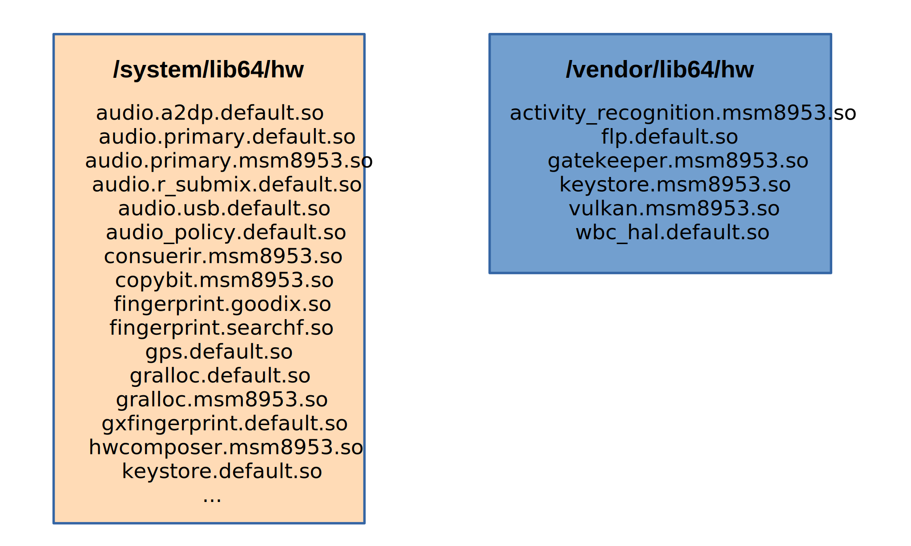
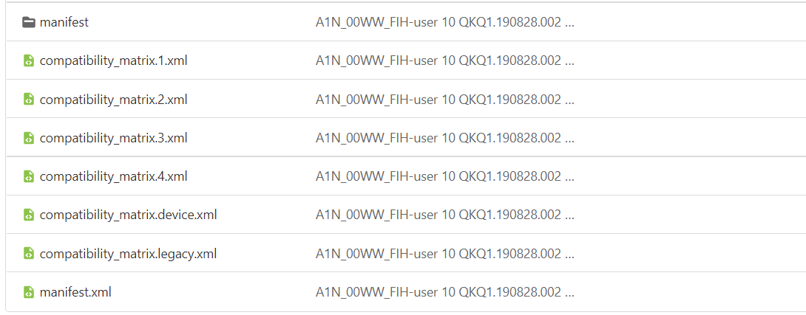
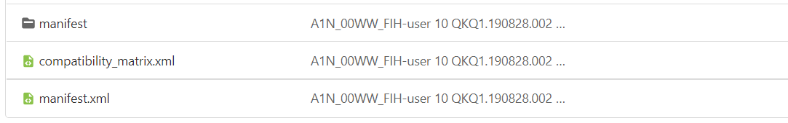
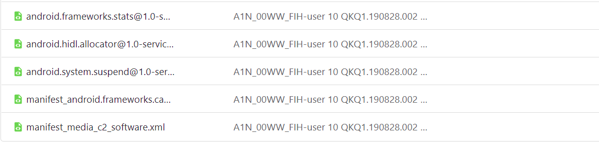
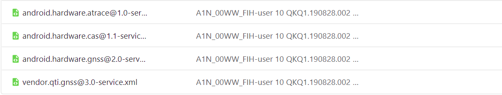
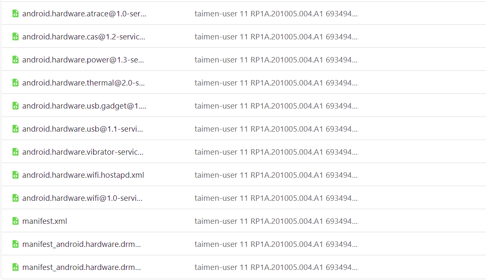
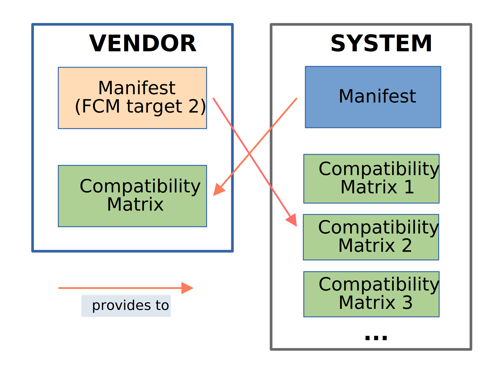

# Project Treble

Android 8.0 re-architected the Android OS framework (in a project known as Treble) to make it easier, faster, and less costly for manufacturers to update devices to a new version of Android. Project Treble is available for all new devices launched with Android 8.0 and later. At the time of writing the most recent Android version is 11, so most devices in the market support Project Treble. This is why it is absolutely necessary to comprehend the changes it introduced and how they affect development.

## What is Project Treble?


*Figure 1. The basic principle of Treble*
## Before Treble

Before we begin let's examine the Android system architecture before Treble was introduced. We already know that HALs are the gateway to accessing the hardware beneath any system (if that doesn't ring a bell, read the document about HALs). They are typically used by their service counterparts to get the hardware do a required task. For example the biometrics service uses the fingerprint HAL to register and validate your fingerprint.

In Android Nougat (7.0) and earlier, the android framework and the HAL’s were packaged into system.img. The core android framework and the HALs were tightly coupled. Typically these HALs were in /system/lib(64)/hw. Due to this, updates were slow since every component in the dependency chain needed to be upgraded for every new Android version. In addition any library could load and link to anything it wanted. This is problematic for multiple reasons.

Most of the native libraries were located in the system folder along with the HALs. The vendor folder didn't contain a lot of libraries, mostly proprietary modules for the camera and fingerprint. The hardware related libraries (fingerprint, camera) were directly loaded into the process that needed them using dlopen calls.

To understand this older architecture better, let's look at the Xiaomi Redmi Note 4 an older device launched with Android 7 that doesn't officially support Treble. The /system/lib64/hw folder contains many HALs like audio, fingerprint, gps, display, a2dp (bluetooth audio) etc. On the other hand the vendor counterpart (/vendor/lib64/hw) is almost empty.



*Figure 2. Distribution of HALs between system and vendor pre-Treble*

This also created a dependency problem. Proprietary and vendor libraries were free to link to any core system library they wanted and vise versa, even if they didn't need to. This made it even harder to deliver new Android updates in a timely fashion. 
## Introducing Project Treble

To mitigate the issues presented above Google introduced with Android 8.0 Project Treble. The goal of Treble is simple; to place a hard brick wall between the system and vendor environments. It basically does 2 things:

* Split the vendor folder into it's own partition called vendor
* Disallow vendor libraries from directly linking and using core system libraries

Let's explore each of those changes individually.

## Change #1: The vendor partition
The concept of using a seperate vendor partition already existed before Treble. However it now gets enforced to ensure this divide. The goal of using a vendor partition is to modularize Android partitions and make them interchangeable. For example, it should be possible to upgrade a device system.img from Android R to Android S without the need to upgrade other images (such as vendor.img, product.img, etc.) too.

After spliting the system and vendor partitions however, we still need a way for these partitions to communicate with each other. This communication can be achieved with the definition of a core, standard interface between the Android framework (which resides on the system partition) and vendor-provided code. The system needs to know which HALs the vendor provides and the vendor must be aware of the available framework processes. This is achieved by a standard interface called **V**endor **Int**er**f**ace Object (VINTF) and enables the Android framework to be independent of the vendor/oem partitions.

### Exploring VINTF

VINTF might sound complex, but in reality is just a bunch of xml files. There are 2 sets of these xml files, the first located in /system/etc/vintf which is called **framework VINTF** while the other set is stored in the vendor partition in /vendor/etc/vintf and is refered to as **device VINTF**. When developing a ROM we only -normally- worry about the device VINTF. For the sake of simplicity we will be using the Android [dump](https://dumps.tadiphone.dev/dumps/nokia/a1n_sprout) of the Nokia 8 Sirocco for the examples due it's vanilla state. Let's see now what those folders contain:


*Figure 1. The framework VINTF*


*Figure 2. The device VINTF*

The contents may be different but we can notice some similarities:

* Both have a folder called manifest
* Both have files called compatibility_matrix
* Both have a file called manifest

The contents of the manifest folder aren't of importance to us right now. At the moment though we can deduce that both folders contain only 2 kinds of xml files; **one or more** compatibility matrices and a **single** manifest.

The difference between them is quite simple; the manifest describes the list of HALs **provided** to the other client (framework or device), and the compatibility_matrix describes the HALs that **should be provided** by the other side. Think of it as a trade. Each party offers some products to the other (manifest) while at the same time requiring a specific payment (compatibility_matrix).

### Compatibility Matrices

A short while ago we talked about how Project Treble's goal is to make the system image interchangable and decoupled from the vendor. In that case though, how does this trade of information between system and vendor work when we upgrade the system image to a more recent Android version?

You probably noticed that the framework VINTF contains multiple compatibility_matrix files each appended with a specific number. This number is called the **F**ramework **C**ompatibility **M**atrix (FCM) version. It's very similar to the API level Android apps use to target Android versions. Each Android version including and after 8.0 has its own FCM version number. The following table contains the current FCM versions along with their matching Android versions:

|Android|FCM|
|:----:|:--:|
| 8.0  | 1 |
| 8.1  | 2 |
| 9.0  | 3 |
| 10.0 | 4 |
| 11.0 | 5 |
| 12.0 | 6 |

Each Android version must have a compatibility matrix for every previous Android version. This is to ensure compatibility with older vendors. So for example an Android 11 system (target FCM 5) can be used with an Android 9 vendor (target FCM 3) because it can know which HALs that older vendor can provide by reading the compatibility_matrix.3.xml. 

For instance an Android 9 system must have:

```
compatibility_matrix.1.xml (8.0)
compatibility_matrix.2.xml (8.1)
compatibility_matrix.3.xml (9.0)
```

while an Android 11 system must contain:
```
compatibility_matrix.1.xml (8.0)
compatibility_matrix.2.xml (8.1)
compatibility_matrix.3.xml (9.0)
compatibility_matrix.4.xml (10.0)
compatibility_matrix.5.xml (11.0)
```

To better understand the compatibility matrix, let's analyse the compatibility_matrix.4.xml (I picked this at random) from the Nokia 8 Sirocco Android dump.

```xml
<compatibility-matrix version="1.0" type="framework" level="4">
    <hal format="hidl" optional="true">
        <name>android.hardware.atrace</name>
        <version>1.0</version>
        <interface>
            <name>IAtraceDevice</name>
            <instance>default</instance>
        </interface>
    </hal>
    <hal format="hidl" optional="false">
        <name>android.hardware.audio</name>
        <version>5.0</version>
        <interface>
            <name>IDevicesFactory</name>
            <instance>default</instance>
        </interface>
    </hal>
    <hal format="hidl" optional="false">
        <name>android.hardware.audio.effect</name>
        <version>5.0</version>
        <interface>
            <name>IEffectsFactory</name>
            <instance>default</instance>
        </interface>
    </hal>
    ...
```
*Figure 3. Framework compatibility matrix*

The first line declares the xml version, the VINTF type which in this case is *framework* since it belongs to the system and the FCM version. In our example it is set to 4 which matches its filename and corresponds to Android 10.

The following entries declare a list of HALs that the vendor should provide as "payment" to the system. If any of those are not present in the vendor the system will fail to boot. This also tells us for example that all Android 10 vendors must provide android.hardware.audio@5.0 as a minimum requirement.

If you scroll down the file you might notice something different:

```xml
    ...
    <hal format="hidl" optional="true">
        <name>android.hardware.wifi.supplicant</name>
        <version>1.0-2</version>
        <interface>
            <name>ISupplicant</name>
            <instance>default</instance>
        </interface>
    </hal>
    <kernel version="4.9.165">
        <config>
            <key>CONFIG_ADVISE_SYSCALLS</key>
            <value type="tristate">y</value>
        </config>
        <config>
            <key>CONFIG_AIO</key>
            <value type="tristate">y</value>
        </config>
        <config>
            <key>CONFIG_ANDROID</key>
            <value type="tristate">y</value>
        </config>
        <config>
            <key>CONFIG_ANDROID_BINDER_DEVICES</key>
            <value type="string">binder,hwbinder,vndbinder</value>
        </config>
        ...
```
*Figure 4. Kernel requirements*

The kernel section of the framework compatibility matrix describes the framework's requirements of the Linux kernel on the device. For each config element in the compatibility matrix, it looks up /proc/config.gz to see if the config is present. When a config item is set to n in the compatibility matrix, it must be absent from /proc/config.gz. Finally, a config item not in the compatibility matrix may or may not be present in /proc/config.gz. If the kernel check fails, you will see the following error in the boot log:

```
W VintfObject: VintfObject.verifyWithoutAvb() returns 1: Runtime info and framework compatibility matrix are incompatible: Missing config <>
```
To get rid of this error the developer must check which config is missing and/or mismatched and patch the kernel defconfig appropriately.

### FCM Development Cycle

Android increments the FCM Version for each framework release (such as Android 9, 10, etc). For example let's assume that the current Android version has an FCM version of 5 and that Google is currently developing a new Android version with FCM version 5+1=6. During development, the existing compatibility_matrix.5.xml is copied to a new compatibility_matrix.current.xml. After that compatibility_matrix.5.xml is left untouched so the new Android version can still work with the previous vendor.

When the new Android version is ready and uploaded to AOSP, the compatibility_matrix.current.xml will get renamed to compatibility_matrix.6.xml to match the new Android version. The cycle will continue with the next relase of Android.

You can view the compatibility matrices in Android 11 [here](https://github.com/LineageOS/android_hardware_interfaces/tree/lineage-18.1/compatibility_matrices).

### Device Compatibility Matrix

The device compatibility matrix is the same as the framework compatibility matrix, but it lists the HALs the framework should provide to the vendor. Here's an example device compatibility matrix:

```xml
<compatibility-matrix version="1.0" type="device">
    <hal format="hidl" optional="false">
        <name>android.frameworks.schedulerservice</name>
        <version>1.0</version>
        <interface>
            <name>ISchedulingPolicyService</name>
            <instance>default</instance>
        </interface>
    </hal>
    <hal format="hidl" optional="false">
        <name>android.frameworks.sensorservice</name>
        <version>1.0</version>
        <interface>
            <name>ISensorManager</name>
            <instance>default</instance>
        </interface>
    </hal>
    <hal format="hidl" optional="false">
        <name>android.hidl.allocator</name>
        <version>1.0</version>
        <interface>
            <name>IAllocator</name>
            <instance>ashmem</instance>
        </interface>
    </hal>
    <hal format="hidl" optional="false">
        <name>android.hidl.manager</name>
        <version>1.0</version>
        <interface>
            <name>IServiceManager</name>
            <instance>default</instance>
        </interface>
    </hal>
    ...
```
*Figure 6. Device compatibility matrix*

### Manifests

Similar to compatibility matrices there are 2 types of manifests; the framework and device manifest. The framework manifest declares the HALs the framework can provide to the vendor whereas the device manifest lists all the vendor HALs available to the system. The framework manifest is manually generated by Google and is not supposed to be modified by ROM developers. For this reason we will only look at the device manifest. Let's take a look at the Nokia 8 Sirocco device manifest:

```xml
<manifest version="1.0" type="device" target-level="2">
    <hal format="hidl">
        <name>android.hardware.audio</name>
        <transport>hwbinder</transport>
        <version>5.0</version>
        <interface>
            <name>IDevicesFactory</name>
            <instance>default</instance>
        </interface>
        <fqname>@5.0::IDevicesFactory/default</fqname>
    </hal>
    <hal format="hidl">
        <name>android.hardware.audio.effect</name>
        <transport>hwbinder</transport>
        <version>5.0</version>
        <interface>
            <name>IEffectsFactory</name>
            <instance>default</instance>
        </interface>
        <fqname>@5.0::IEffectsFactory/default</fqname>
    </hal>
    <hal format="hidl">
        <name>android.hardware.biometrics.fingerprint</name>
        <transport>hwbinder</transport>
        <version>2.1</version>
        <interface>
            <name>IBiometricsFingerprint</name>
            <instance>default</instance>
        </interface>
        <fqname>@2.1::IBiometricsFingerprint/default</fqname>
    </hal>
    ...
```
*Figure 7. Device manifest*

The first line declares the xml version, the VINTF type which in this case is *device* since it resides in the vendor partition and the target FCM version. However there is something noteworthy here. Despite the fact that this particular manifest belongs to an Android 10 vendor, it declares itself as an Android 8.1 (FCM target 2) vendor. Why does it do that? 

The answer is simple; with every new Android version the HAL requirements get stricter and stricter. Support for older HALs gets dropped in favour of newer more modern versions. However some legacy devices might require an older version of the HAL to work properly. If vendors do not implement all required new HAL versions or do not remove deprecated HAL versions, the target FCM version cannot be upgraded. For example, the Android 11 update (FCM target 5) for the Pixel 2 still targets FCM version 2. While it does implement some newer HALs required by compatibility_matrix.5.xml (such as audio 6.0), it can't remove android.hardware.radio.deprecated@1.0, which was deprecated back at FCM version 3 (Android 9) because it is necessary for the msm8998 RIL stack to work properly. Hence the target FCM version cannot be upgraded to anything more than 2. You can check the Pixel 2 manifest [here](https://dumps.tadiphone.dev/dumps/google/taimen/-/blob/taimen-user-11-RP1A.201005.004.A1-6934943-release-keys/vendor/etc/vintf/manifest.xml#L5).

On a similar note, another infamous example is that of the radio HAL itself. Devices launched with msm8998 (Snapdragon 835) or an older chipset do not support any version of the radio HAL newer than 1.1 due to a limitation in the modem. However Android Q [required](https://github.com/LineageOS/android_hardware_interfaces/commit/0bc890da0c68764c21bac9154be84291c658cf4a#diff-11f916a21a1a5a6b0b6f622f06a39a7df6ddf420ee4c9da0870a8439a7f2a464) vendors to implement radio 1.4 as a minimum requirement. The only way to circumvent this is to target a lower FCM version than Q (FCM target 4). If you are interested in this specific issue you can read [this](https://github.com/LineageOS/android_device_fxtec_pro1/commit/1a96855acaaffa7ca0c2ccfb2e1eb46e3f896080#diff-06e6215f32570c3a47a6a5336751fce3691dec5f07093b0f5214a65e07a49a1e) commit description to better understand why the radio HAL can't be upgraded on legacy devices.

This is why many OEMs target older FCM versions; to ensure maximum HAL compatibility. However as a custom ROM developer, it is beneficial to upgrade the FCM version when possible. Before upgrading the FCM version though some research is necessary to determine which HALs can be upgraded and which cannot.

### VINTF Fragments

Remember that manifest folder we looked at the beginning? It is also important so let's take a look now at what this folder contains.


*Figure 8. The framework manifest folder (/system/etc/vintf/manifest)*


*Figure 9. The vendor manifest folder (/vendor/etc/vintf/manifest)*

First let's note some noteworthy observations:

* Most xml files end with -service
* If you open them, most of them have a single HAL entry that matches their filename (you should also check this yourself)

Each xml file in the manifest folder is called a **VINTF fragment**.VINTF fragments are a new feature introduced in Android 10. With fragments it is possible associate a manifest HAL entry with its respective service in the build system. It decentralizes the manifest file by pairing individual HAL entries with their matching services (look at [this](https://github.com/LineageOS/android_hardware_interfaces/commit/2d7820a6ef2df58f2417f2ea7bfefe01c763e807) commit for an example). If a VINTF fragment for a service exists, the HAL entry must be removed from the device manifest to prevent conflicts (look [here](https://github.com/LineageOS/android_device_oneplus_msm8998-common/commit/3e2a5f15ecbc37a40b6bc77e10c3d41120485119) for an example). All VINTF fragments are placed in the manifest folder. Android 11 started enforcing VINTF fragments to vendor HALs as well as framework HALs. For this reason the vendor manifest folder is a lot more populated in Android 11 compared to Android 10.


*Figure 10. The vendor manifest folder in Android 11*



*Figure 8. The VINTF validation process*
### Implementing VINTF

Adding VINTF to a device tree is very easy. As suggested by Google, at the root of your device tree import the device manifest and compatibility matrix files from the stock ROM of your device. Then add the following to BoardConfig.mk (DEVICE_PATH must point at the root of your device tree)

```makefile
# HIDL
DEVICE_MANIFEST_FILE := $(DEVICE_PATH)/manifest.xml
DEVICE_MATRIX_FILE := $(DEVICE_PATH)/compatibility_matrix.xml
```

### VINTF Example: OTA updates

Manifest and Matrix will perform matching checks before the OTA upgrade to ensure that the framework and device are compatible. In general, the manifest is the provider, and the matrix is ​​the demand.