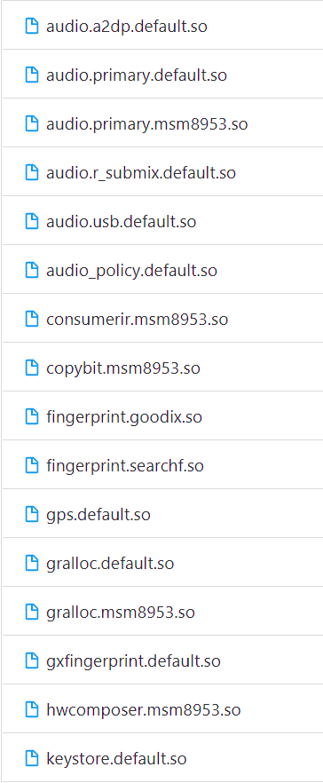
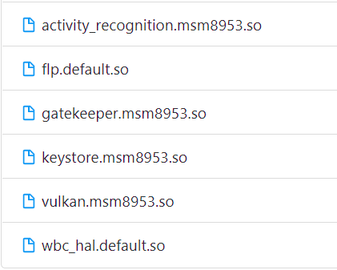
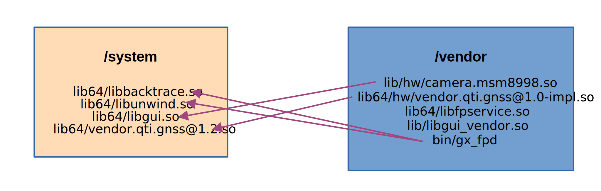

# Treble

Android 8.0 re-architected the Android OS framework (in a project known as Treble) to make it easier, faster, and less costly for manufacturers to update devices to a new version of Android. Project Treble is available for all new devices launched with Android 8.0 and later. At the time of writing the most recent Android version is 11, so most devices in the market support Project Treble. This is why it is absolutely necessary to comprehend the changes it introduced and how they affect development.

## Before Treble

Before we begin let's examine the Android system architecture before Treble was introduced. We already know that HALs are the gateway to accessing the hardware beneath any system (if that doesn't ring a bell, read the document about HALs). They are typically used by their service counterparts to get the hardware do a required task. For example the biometrics service uses the fingerprint HAL to register and validate your fingerprint.

In Android Nougat (7.0) and earlier, the android framework and the HAL’s were packaged into system.img. The core android framework and the HALs were tightly coupled. Typically these HALs were in /system/lib(64)/hw. Due to this, updates were slow since every component in the dependency chain needed to be upgraded for every new Android version. In addition any library could load and link to anything it wanted. This is problematic for multiple reasons.

Most of the native libraries were located in the system folder along with the HALs. The vendor folder didn't contain a lot of libraries, mostly proprietary modules for the camera and fingerprint. The hardware related libraries (fingerprint, camera) were directly loaded into the process that needed them using dlopen calls.

To understand this older architecture better, let's look at the Xiaomi Redmi Note 4 an older device launched with Android Nougat that doesn't officially support Treble. The /system/lib64/hw folder contains many HALs like audio, fingerprint, a2dp (bletooth audio) etc. On the other hand the vendor counterpart (/vendor/lib64/hw) is almost empty.

/system/lib64/hw           |  /vendor/lib64/hw
:-------------------------:|:-------------------------:
|

This also created a dependency problem. Proprietary and vendor libraries were free to link to any system library they wanted and vise versa, even if they didn't need to. This made it even harder to deliver new Android upgrade in a timely fashion. As an example we can look at a few vendor and system libraries for the Nokia 8, an Android device that also doesn't support Project Treble. The gx_fpd daemon implements fingerprint functionality and the camera.msm8998.so library is the camera HAL. Every arrow points to a dependecy of that specific vendor library.

## Introducing Project Treble

